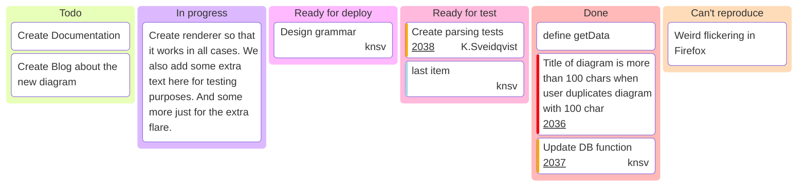

   

## 1\. DEVICE OVERVIEW

The SKY130 SerDes PHY is a single-lane serial transceiver implementing Manchester-encoded differential signalling at 240 Mbps. The device integrates a transmit PLL, receive clock/data recovery circuit, dual FIFOs, and pseudorandom bit sequence (PRBS) test pattern generator/checker. Configuration and monitoring are provided through an I²C slave interface.

### 1.1 Key Features

* Single-lane differential TX/RX at 240 Mbps
* Manchester line coding for DC balance
* 24 MHz reference clock input
* Ring-oscillator based transmit PLL with 10× multiplication
* Bang-bang phase detector CDR in receiver
* 8-word deep TX and RX FIFOs with 4-bit external interface
* PRBS-7 pattern generation and verification
* I²C register-based configuration (slave address 0x42)
* Integrated analog loopback capability
* Supply voltage: 1.8V digital, 3.3V analog I/O

### 1.2 Applications

* High-density FPGA/ASIC prototyping
* Multi-chip module serial links
* Educational SerDes demonstration
* Tiny Tapeout SoC integration

---

## 2\. FUNCTIONAL BLOCK DIAGRAM


---

## 3\. PIN CONFIGURATION

### 3.1 Pin Assignment (24-pin Package)

**INPUTS (8):**

| Pin | Symbol | Description | Electrical |
| -- | -- | -- | -- |
| IN0 | CLK_REF | 24 MHz reference clock | CMOS, 50% duty |
| IN1 | RST_N | Active-low reset | CMOS, async |
| IN2 | TXD\[0\] | Transmit data bit 0 | CMOS |
| IN3 | TXD\[1\] | Transmit data bit 1 | CMOS |
| IN4 | TXD\[2\] | Transmit data bit 2 | CMOS |
| IN5 | TXD\[3\] | Transmit data bit 3 | CMOS |
| IN6 | TX_VALID | TX data valid strobe | CMOS |
| IN7 | TEST_MODE | Test mode enable | CMOS |

**OUTPUTS (8):**

| Pin | Symbol | Description | Electrical |
| -- | -- | -- | -- |
| OUT0 | RXD\[0\] | Receive data bit 0 | CMOS |
| OUT1 | RXD\[1\] | Receive data bit 1 | CMOS |
| OUT2 | RXD\[2\] | Receive data bit 2 | CMOS |
| OUT3 | RXD\[3\] | Receive data bit 3 | CMOS |
| OUT4 | PLL_LOCK | PLL lock indicator | CMOS |
| OUT5 | CDR_LOCK | CDR lock indicator | CMOS |
| OUT6 | PRBS_ERR | PRBS error flag | CMOS |
| OUT7 | RX_VALID | RX data valid strobe | CMOS |

**BIDIRECTIONAL (8):**

| Pin | Symbol | Dir | Description | Electrical |
| -- | -- | -- | -- | -- |
| IO0 | SDA | I/O | I²C data | Open-drain |
| IO1 | SCL | I | I²C clock (≤24 MHz) | CMOS |
| IO2 | TXP | O | TX differential (+) | CML, 100Ω diff |
| IO3 | TXN | O | TX differential (−) | CML, 100Ω diff |
| IO4 | RXP | I | RX differential (+) | CML, 100Ω diff |
| IO5 | RXN | I | RX differential (−) | CML, 100Ω diff |
| IO6 | LPBK_EN | I | Analog loopback enable | CMOS |
| IO7 | DBG_ANA | O | Analog debug buffer | Analog |

---

## 4\. DETAILED FUNCTIONAL DESCRIPTION

### 4.1 Clock Architecture

The device operates from a single 24 MHz reference clock (CLK_REF). All digital logic is synchronous to this clock or its derivatives.

**Clock Domains:**

* **CLK_24M:** Reference clock domain (all CSRs, FIFO control, word assembly)
* **CLK_240M_TX:** Transmit serializer clock (PLL output, 10× reference)
* **CLK_240M_RX:** Recovered clock domain (CDR VCO output)

**PLL Specifications:**

| Parameter | Min | Typ | Max | Unit |
| -- | -- | -- | -- | -- |
| Input frequency | 23.5 | 24.0 | 24.5 | MHz |
| Output frequency | 235 | 240 | 245 | MHz |
| Multiplication ratio | — | 10 | — | — |
| Lock time | — | 8 | 10 | µs |
| Jitter (RMS) | — | 50 | 100 | ps |
| VCO tuning range | 200 | — | 400 | MHz |

### 4.2 Transmit Datapath

The transmit path accepts 4-bit parallel data at 12 MHz effective rate (TX_VALID gating) and serializes to 240 Mbps differential output.

**TX Signal Flow:**

1. **Word Assembler:** Combines two 4-bit nibbles into 8-bit words over two CLK_24M cycles
2. **TX FIFO:** 8-deep × 8-bit buffer clocked at 24 MHz
3. **Data Multiplexer:** Selects between FIFO output or PRBS generator
4. **Manchester Encoder:** Converts 8-bit parallel to 16-bit biphase code
5. **Serializer:** Shifts out 16 bits at 240 MHz (15 ns/bit)
6. **Differential Driver:** CML output stage, 100Ω differential impedance

**PRBS Generator:**

* Polynomial: x⁷ + x⁶ + 1
* Output width: 8 bits parallel
* Update rate: 24 MHz
* Bypasses FIFO when enabled via CSR

**FIFO Characteristics:**

| Parameter | Value |
| -- | -- |
| Depth | 8 words |
| Width (internal) | 8 bits |
| Width (external) | 4 bits |
| Write clock | 24 MHz |
| Effective write rate | 12 MHz (gated by TX_VALID) |
| Full threshold | 7 words |
| Empty threshold | 0 words |
| Overflow action | Assert FIFO_ERR, discard data |

### 4.3 Receive Datapath

The receive path recovers 240 Mbps differential signal and presents 4-bit parallel data at 12 MHz effective rate.

**RX Signal Flow:**

1. **Differential Receiver:** Limiting amplifier with \~10 mV sensitivity
2. **CDR:** Bang-bang phase detector with Alexander architecture
3. **Deserializer:** 16-bit shift register at 240 MHz recovered clock
4. **Manchester Decoder:** Biphase to 8-bit parallel conversion
5. **RX FIFO:** 8-deep × 8-bit buffer with clock domain crossing
6. **Word Disassembler:** 8-bit to dual 4- babit output over two cycles

**CDR Specifications:**

| Parameter | Min | Typ | Max | Unit |
| -- | -- | -- | -- | -- |
| Acquisition range | ±2000 | — | — | ppm |
| Lock time | — | 50 | 100 | µs |
| Tracking bandwidth | — | 1 | — | MHz |
| Phase error (RMS) | — | 5 | 10 | UI |

**PRBS Checker:**

* Compares decoded data against expected PRBS-7 sequence
* Single-bit error detection per 8-bit word
* Error counter saturates at 255
* Counter reset via RX_ALIGN_RST

### 4.4 Manchester Encoding

Manchester encoding ensures DC balance and embedded clock recovery. Each data bit is encoded as a transition:

* Logic 0: High-to-Low transition at bit center
* Logic 1: Low-to-High transition at bit center

**Encoding Properties:**

* Doubles symbol rate (1 bit → 2 symbols)
* Guaranteed transition density: 100%
* DC balance: ±0 over any two symbols
* Run length: Maximum 1 symbol

---

## 5\. REGISTER DESCRIPTION

All configuration and status registers (CSRs) are accessible via I²C slave interface at address 0x42 (7-bit). All registers are 8 bits wide with byte-level addressing.

### 5.1 PHY_ENABLE (Address 0x00)

| Bit | Name | R/W | Default | Description |
| -- | -- | -- | -- | -- |
| 0 | PHY_EN | R/W | 0 | PHY global enable (0=off, 1=on) |
| 1 | ISO_EN | R/W | 1 | Analog isolation (0=connected, 1=isolated) |
| 7:2 | — | — | 0 | Reserved |

**Functional Description:**

PHY_EN gates all internal clocks and holds PLL/CDR in reset. ISO_EN disconnects analog bias circuits when set. During power-up, PHY_EN must remain 0 until supply voltages stabilize.

### 5.2 TX_CONFIG (Address 0x01)

| Bit | Name | R/W | Default | Description |
| -- | -- | -- | -- | -- |
| 0 | TX_EN | R/W | 0 | Enable transmit datapath |
| 1 | TX_FIFO_EN | R/W | 0 | Enable TX FIFO |
| 2 | TX_PRBS_EN | R/W | 0 | Enable PRBS generator |
| 3 | TX_IDLE | R/W | 0 | Force idle pattern (all zeros) |
| 7:4 | — | — | 0 | Reserved |

**Register Interactions:**

* TX_PRBS_EN = 1  enables PRBS generator output 
* TX_FIFO_EN = 1 enables FIFO data output.
* TX_IDLE overrides all data sources
* TX_EN must be 0 when changing data source via DATA_SELECT register

### 5.3 RX_CONFIG (Address 0x02)

| Bit | Name | R/W | Default | Description |
| -- | -- | -- | -- | -- |
| 0 | RX_EN | R/W | 0 | Enable receive datapath |
| 1 | RX_FIFO_EN | R/W | 0 | Enable RX FIFO |
| 2 | RX_PRBS_CHK_EN | R/W | 0 | Enable PRBS checker |
| 3 | RX_ALIGN_RST | R/W | 0 | Reset alignment FSM and error counter |
| 7:4 | — | — | 0 | Reserved |

**Functional Description:**

RX_ALIGN_RST is self-clearing and triggers a single-cycle reset pulse. RX_PRBS_CHK_EN requires PRBS data on the serial input.

### 5.4 DATA_SELECT (Address 0x03)

| Bit | Name | R/W | Default | Description |
| -- | -- | -- | -- | -- |
| 0 | TX_DATA_SEL | R/W | 1 | TX source: 0=FIFO, 1=PRBS |
| 1 | RX_DATA_SEL | R/W | 0 | RX output: 0=FIFO, 1=PRBS status |
| 7:2 | — | — | 0 | Reserved |

**Constraint:**

Changing TX_DATA_SEL while TX_EN=1 results in undefined transmit data.

### 5.5 PLL_CONFIG (Address 0x04)

| Bit | Name | R/W | Default | Description |
| -- | -- | -- | -- | -- |
| 3:0 | VCO_TRIM | R/W | 0x8 | VCO frequency coarse trim |
| 5:4 | CP_CURRENT | R/W | 0x2 | Charge pump current select |
| 6 | PLL_RST | R/W | 1 | PLL reset (active high) |
| 7 | PLL_BYPASS | R/W | 0 | Bypass PLL (test mode) |

**VCO_TRIM Encoding:**

| Value | Frequency |
| -- | -- |
| 0x0 | \~200 MHz |
| 0x8 | \~240 MHz (nominal) |
| 0xF | \~400 MHz |

**CP_CURRENT Encoding:**

| Value | Current |
| -- | -- |
| 0x0 | 10 µA |
| 0x1 | 20 µA |
| 0x2 | 40 µA (default) |
| 0x3 | 80 µA |

### 5.6 CDR_CONFIG (Address 0x05)

| Bit | Name | R/W | Default | Description |
| -- | -- | -- | -- | -- |
| 2:0 | CDR_GAIN | R/W | 0x4 | Bang-bang loop gain setting |
| 3 | CDR_FAST_LOCK | R/W | 0 | Fast acquisition mode |
| 4 | CDR_RST | R/W | 1 | CDR reset (active high) |
| 7:5 | — | — | 0 | Reserved |

**CDR_GAIN:** Higher values increase tracking bandwidth but reduce noise immunity. Recommended range: 0x3–0x6.

### 5.7 STATUS (Address 0x06, Read-Only)

| Bit | Name | R | Description |
| -- | -- | -- | -- |
| 0 | PLL_LOCK | R | PLL frequency lock indicator |
| 1 | CDR_LOCK | R | CDR phase lock indicator |
| 2 | TX_FIFO_FULL | R | TX FIFO full flag |
| 3 | TX_FIFO_EMPTY | R | TX FIFO empty flag |
| 4 | RX_FIFO_FULL | R | RX FIFO full flag |
| 5 | RX_FIFO_EMPTY | R | RX FIFO empty flag |
| 6 | PRBS_ERR | R | PRBS error detected (latched) |
| 7 | FIFO_ERR | R | FIFO overflow/underflow (latched) |

**Status Flags:**

* PLL_LOCK asserts when VCO frequency is within ±2% of target
* CDR_LOCK asserts when phase error <0.1 UI for >64 consecutive bits
* PRBS_ERR and FIFO_ERR are sticky and clear on read

### 5.8 DEBUG_ENABLE (Address 0x07)

| Bit | Name | R/W | Default | Description |
| -- | -- | -- | -- | -- |
| 0 | DBG_VCTRL | R/W | 0 | Route VCO control voltage to DBG_ANA |
| 1 | DBG_PD | R/W | 0 | Route phase detector output to DBG_ANA |
| 2 | DBG_FIFO | R/W | 0 | Route FIFO status to DBG_ANA |
| 7:3 | — | — | 0 | Reserved |

**Note:** Only one debug source may be active at a time.

---

## 6\. I²C INTERFACE TIMING

### 6.1 AC Characteristics

| Parameter | Symbol | Min | Max | Unit |
| -- | -- | -- | -- | -- |
| SCL clock frequency | f_SCL | 10 | 24,000 | kHz |
| SCL low period | t_LOW | 0.5 | — | µs |
| SCL high period | t_HIGH | 0.5 | — | µs |
| SDA setup time | t_SU | 100 | — | ns |
| SDA hold time | t_HD | 0 | — | ns |
| Start condition hold | t_HD:STA | 0.6 | — | µs |
| Stop condition setup | t_SU:STO | 0.6 | — | µs |

### 6.2 Transaction Format

**Write Operation:**

```
START | ADDR(0x42) + W | ACK | REG_ADDR | ACK | DATA | ACK | STOP
```

**Read Operation:**

```
START | ADDR(0x42) + W | ACK | REG_ADDR | ACK |
START | ADDR(0x42) + R | ACK | DATA | NACK | STOP
```

---

## 7\. ELECTRICAL CHARACTERISTICS

### 7.1 Absolute Maximum Ratings

| Parameter | Min | Max | Unit |
| -- | -- | -- | -- |
| Digital supply (DVDD) | −0.3 | 2.0 | V |
| Analog supply (AVDD) | −0.3 | 3.6 | V |
| Input voltage (digital) | −0.3 | DVDD+0.3 | V |
| Differential input (RXP/RXN) | −0.5 | AVDD+0.5 | V |
| Storage temperature | −65 | 150 | °C |

### 7.2 Recommended Operating Conditions

| Parameter | Min | Typ | Max | Unit |
| -- | -- | -- | -- | -- |
| Digital supply (DVDD) | 1.71 | 1.8 | 1.89 | V |
| Analog supply (AVDD) | 3.0 | 3.3 | 3.6 | V |
| Operating temperature | −40 | 25 | 85 | °C |
| Reference clock frequency | 23.5 | 24.0 | 24.5 | MHz |

### 7.3 DC Characteristics (T_A = 25°C, DVDD = 1.8V, AVDD = 3.3V)

| Parameter | Condition | Min | Typ | Max | Unit |
| -- | -- | -- | -- | -- | -- |
| Logic high input (V_IH) | Digital pins | 0.7×DVDD | — | DVDD | V |
| Logic low input (V_IL) | Digital pins | 0 | — | 0.3×DVDD | V |
| Logic high output (V_OH) | I_OH = −2 mA | 0.8×DVDD | — | — | V |
| Logic low output (V_OL) | I_OL = 2 mA | — | — | 0.2×DVDD | V |
| Differential input sensitivity | RXP/RXN | 10 | — | — | mV_pp |
| Differential output swing | TXP/TXN, 100Ω | 400 | 600 | 800 | mV_pp |
| Supply current (active) | PHY_EN=1 | — | 12 | 18 | mA |
| Supply current (idle) | PHY_EN=0 | — | 100 | 200 | µA |

---

## 8\. TYPICAL APPLICATION

### 8.1 Loopback Test Configuration

```
                 ┌─────────────────┐
  24 MHz ────────┤CLK_REF    TXP/TXN├──┐
                 │                 │  │  100Ω
  SDA ───────────┤SDA         RXP/RXN├──┘  differential
  SCL ───────────┤SCL              │     loop
                 │            LPBK_EN├──── VDD (loopback enable)
  TXD[3:0] ──────┤TXD[3:0]         │
  TX_VALID ──────┤TX_VALID    RXD[3:0]├──── (monitor)
                 │                 │
  RST_N ─────────┤RST_N   PLL_LOCK ├──── (monitor)
                 │        CDR_LOCK ├──── (monitor)
                 │       PRBS_ERR ├──── (monitor)
                 └─────────────────┘
```

**Initialization Sequence:**

 1. Apply AVDD, then DVDD
 2. Assert RST_N low for ≥10 CLK_REF cycles
 3. Configure I²C: Write 0x01 to PHY_ENABLE (enable PHY)
 4. Write 0x00 to PLL_CONFIG\[6\] (release PLL reset)
 5. Poll STATUS\[0\] until PLL_LOCK asserts
 6. Write 0x05 to TX_CONFIG (enable TX with PRBS)
 7. Write 0x01 to DATA_SELECT (select PRBS source)
 8. Write 0x00 to CDR_CONFIG\[4\] (release CDR reset)
 9. Write 0x05 to RX_CONFIG (enable RX with PRBS check)
10. Poll STATUS\[1\] until CDR_LOCK asserts
11. Monitor STATUS\[6\] (PRBS_ERR should remain low)

---

## 9\. MECHANICAL DATA

### 9.1 Package Information

* **Type:** 24-pin QFN (4mm × 4mm)
* **Pitch:** 0.5 mm
* **Exposed pad:** 2.5mm × 2.5mm (connect to ground)
* **Package marking:** Part number + date code

---

## 10\. ORDERING INFORMATION

| Part Number | Package | Temperature Range | Tape & Reel |
| -- | -- | -- | -- |
| SKY130-SERDES-240M | 24-QFN | −40°C to +85°C | 3000/reel |


## Project Tracking




