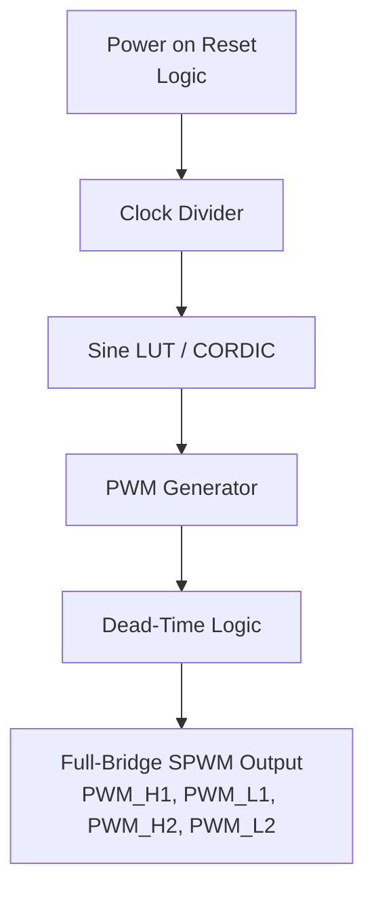
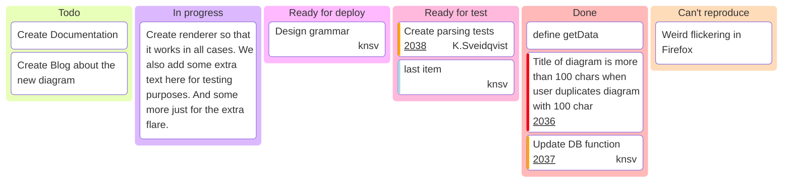

   

# Pure Sine Wave Generator
- [Read the documentation for project](docs/info.md)

## Overview
This project aims to design a digital Pure Sine Wave Generator (PSWG) for controlling a full-bridge inverter using four SPWM (Sinusoidal Pulse Width Modulation) outputs. The system will be implemented in Verilog, prototyped on an FPGA, and prepared for eventual ASIC tape-out. The design provides configurable frequency, amplitude, and dead-time insertion for safe switching of the full-bridge MOSFETs/IGBTs.

## Objectives
- Generate a pure sine wave output for a full-bridge inverter using digital SPWM.
- Implement 4 independent SPWM outputs to drive high-side and low-side switches.
- Ensure configurable parameters for frequency, amplitude, and dead-time.
- Validate the design on FPGA before ASIC tape-out.
- Provide a modular Verilog implementation suitable for integration with other power electronics controllers.

## Functional Requirements

### 1. SPWM Generation
- Produce SPWM signals based on a sine lookup table (LUT) or CORDIC-based sine calculation.
- Configurable carrier frequency (PWM frequency) and modulation frequency (sine wave output frequency).
- Resolution: Minimum 10-bit PWM resolution.
- Adjustable amplitude scaling.

### 2. Full-Bridge Control
- Generate 4 complementary SPWM signals for the full-bridge inverter:
  - `PWM_H1`, `PWM_L1` for leg 1
  - `PWM_H2`, `PWM_L2` for leg 2
- Include configurable dead-time insertion between high-side and low-side switches to prevent shoot-through.

### 3. Parameter Configuration
- Input registers for:
  - Output sine frequency (e.g., 50 Hz, 60 Hz)
  - PWM carrier frequency (e.g., 10 kHz – 20 kHz)
  - Modulation index / amplitude
  - Dead-time in clock cycles
- Optional digital enable/disable of the inverter outputs.

### 4. Clock and Timing
- Design should support FPGA clock frequencies from 50 MHz to 200 MHz.
- Provide internal clock dividers for PWM generation and sine table indexing.
- Sine table indexing should allow arbitrary phase offset between outputs if required.

### 5. Interfaces
- **Inputs:**
  - `clk` (system clock)
  - `rst` (synchronous reset)
  - `enable` (start/stop SPWM outputs)
  - `freq_config` (sine frequency control)
  - `amp_config` (modulation index control)
  - `deadtime_config` (dead-time insertion)
- **Outputs:**
  - `PWM_H1`, `PWM_L1`, `PWM_H2`, `PWM_L2` (digital SPWM outputs)

## Non-Functional Requirements
- FPGA resource efficiency: minimize LUT, FF, and BRAM usage.
- Low jitter and precise PWM timing.
- Scalable design to support multiple inverter legs in the future.
- Modular Verilog coding style for reusability.
- Testable via simulation (ModelSim, Vivado Simulator) and FPGA validation.
- Prepare documentation and testbench for verification.

## Hardware Requirements
- FPGA development board with sufficient I/Os (e.g., Xilinx Artix-7, Intel Cyclone V)
- Optional external MOSFET/IGBT full-bridge test circuit
- Logic analyzer or oscilloscope for waveform verification

## Verification & Testing
1. **Simulation**
   - Functional simulation of SPWM generation with varying sine and PWM frequencies.
   - Verify dead-time insertion and complementary switching logic.
   - Check modulation depth and amplitude correctness.
   
2. **FPGA Testing**
   - Deploy the Verilog design to FPGA.
   - Use oscilloscope or logic analyzer to capture PWM waveforms.
   - Verify phase alignment and complementary outputs.
   
3. **Performance Metrics**
   - THD (Total Harmonic Distortion) of synthesized sine wave.
   - PWM frequency accuracy.
   - Dead-time accuracy.

## Deliverables
- Verilog RTL code for SPWM and full-bridge control.
- Simulation testbench with waveform outputs.
- FPGA bitstream for validation.
- Documentation including block diagrams, timing diagrams, and configuration guide.

## Block Diagram

## Project Tracking

